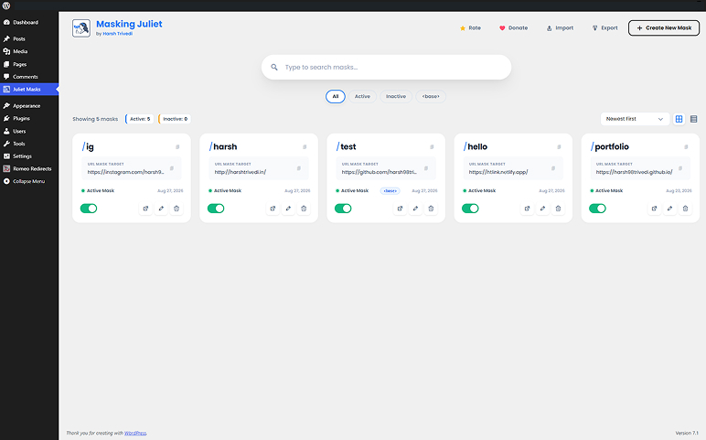
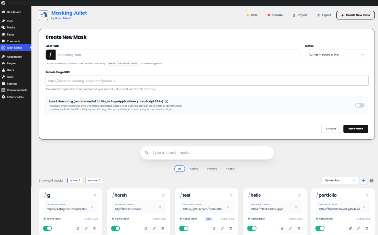
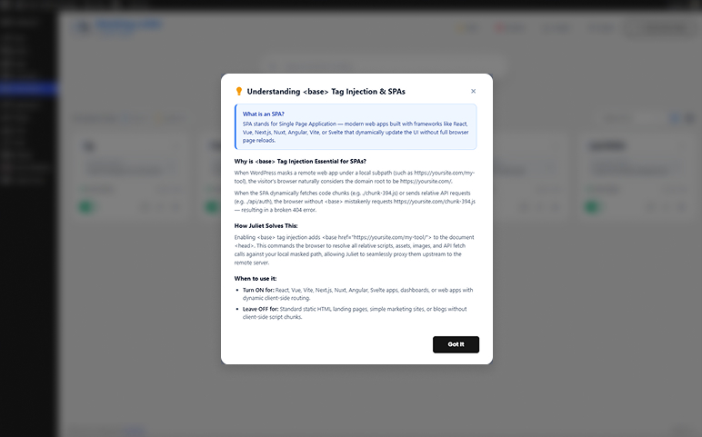
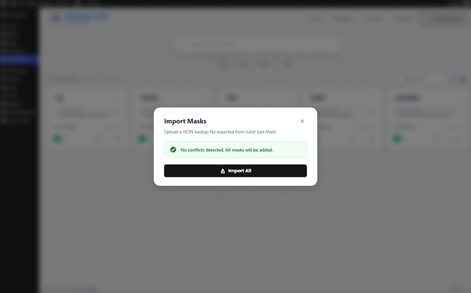
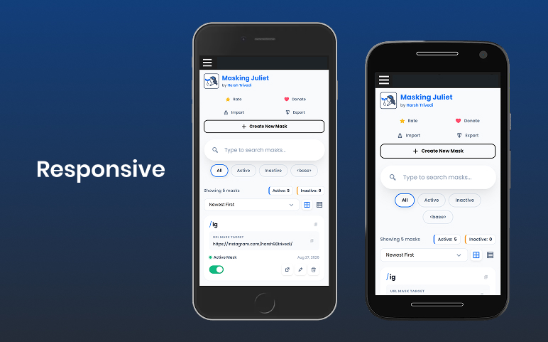
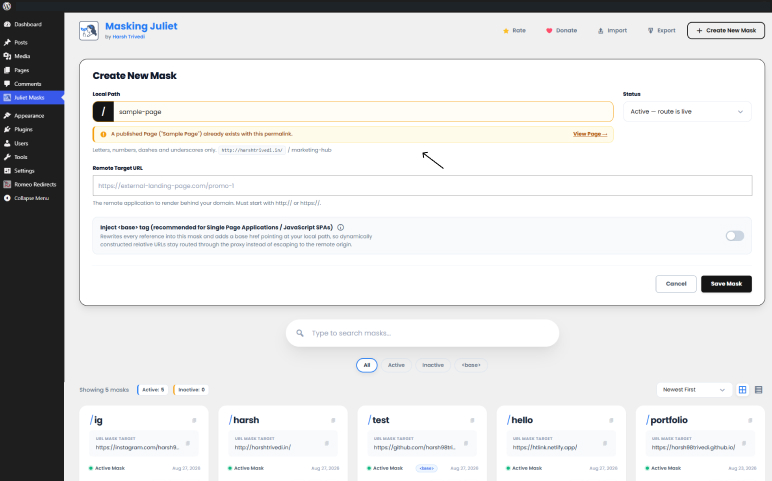

<p align="center">
  
</p>

# Juliet Just Mask 🎭

> **URL Masking, Mask Manager & Native Reverse Proxy Companion for WordPress**  
> High-performance URL masker to serve remote web applications, SPAs, and landing pages natively on your WordPress domain — zero iframes, zero Nginx / Apache config.

[](https://wordpress.org)
[](https://php.net)
[](https://www.gnu.org/licenses/gpl-2.0.html)
[]()

---

## 📖 Overview

While redirect managers focus on **Open Routing** (moving traffic from URL A to URL B and changing the browser's address bar), **Juliet Just Mask** delivers **Stealth Routing** (Reverse Proxy) as a dedicated **URL Mask Manager** and **URL Masker**.

Juliet intercepts incoming HTTP requests on designated local paths, keeps the visitor’s address bar unchanged, fetches the dynamic content or Single-Page Application (SPA) from a remote target server, patches relative assets and links on the fly, and delivers the payload seamlessly.

```
Visitor Browser                WordPress (Juliet Engine)                Remote Target App
   [ user.com/app ]   ───►   [ Early Route Interceptor ]   ───►   [ target.internal:3000/ ]
                             [ Asset & Link Patcher    ]
   [ Rendered App ]   ◄───   [ Strict MIME & Deliver   ]   ◄───   [ Dynamic HTML/Assets   ]
```

---

## ✨ Key Features

- **⚡ Zero-Latency Early Router**: Hooks into `parse_request` with sub-millisecond route matching. Toggling masks active or inactive takes effect **instantly** without rewrite cache lag.
- **🌐 Unlimited Sub-Path Routing**: Proxy entire applications seamlessly. `/marketing-hub` maps to the root, and `/marketing-hub/pricing` automatically routes to the remote `/pricing` endpoint.
- **🏷️ SPA & `<base>` Tag Injector**: Inject a smart `<base href="...">` tag and rewrite root-relative asset attributes (`src`, `href`, `data-src`, `srcset`, inline CSS `url()`, etc.) so JavaScript SPAs (React, Vue, Next.js, Svelte, etc.) run smoothly without escaping to the remote origin.
- **🎨 Modern Admin Dashboard**: Visual grid and list views with real-time live search, custom dropdown filtering, and instant AJAX on/off toggles.
- **🛡️ Enterprise Security & SSRF Protection**: Validates every remote target, blocks loop recursion (`X-Juliet-Proxy`), sanitizes headers against CRLF injection, and checks resolved IPs against private/reserved ranges (with auto-bypass for local dev).
- **🚀 Static Asset Streaming & Caching**: Smart MIME detection (`.js`, `.css`, `.svg`, `.woff2`, `.json`, etc.) with browser caching headers and transient response caching.
- **🔄 Link Masking**: Rewrites absolute links pointing to the remote server back into your local mask URL structure so visitors stay on your domain.
- **📦 Backup & Migration**: Built-in JSON Export and Conflict-Aware Import system with merge and overwrite capabilities.
- **🩹 Graceful 404 Fallback**: Automatically invokes your theme's native 404 page if a remote target goes down or times out.

---

## 🛠️ How It Works

1. **Routing**: When a visitor requests a path like `yoursite.com/my-tool`, Juliet's router intercepts the request before standard database queries execute.
2. **SSRF & Security Validation**: Validates the protocol (`http`/`https`), checks against private IP ranges, strips malicious characters, and verifies loop guards.
3. **Outbound Fetching**: Proxies the request with visitor metadata headers (`X-Forwarded-For`, `User-Agent`, `Accept-Language`, `X-Forwarded-Proto`).
4. **HTML & Asset Patching**:
   - Injects `<base href="https://yoursite.com/my-tool/">` when enabled.
   - Rewrites root-relative URLs (`/static/bundle.js` → `/my-tool/static/bundle.js`).
   - Rewrites internal CSS `url()` assets and standalone stylesheets.
   - Converts same-origin remote navigation links back to local mask paths.
5. **Delivery**: Sends status codes, accurate MIME types, and headers, then terminates execution cleanly.

---

## 🚀 Installation & Quick Start

### Installation
1. Download or clone this repository into `/wp-content/plugins/juliet-just-mask/`.
2. Activate the plugin through the WordPress **Plugins** screen (`wp-admin/plugins.php`).
3. Access **Juliet Just Mask** in your WordPress admin menu.

### Creating Your First Mask
1. Click **Create New Mask** in the top-right toolbar.
2. Enter your desired **Local Path** (e.g. `dashboard` or `promo-app`).
3. Enter your **Remote Target URL** (e.g. `https://my-cloud-app.vercel.app`).
4. Toggle **Inject `<base>` tag** if the target is a JavaScript-heavy SPA.
5. Click **Save Mask**. Visiting `yoursite.com/dashboard` will now load your remote application!

---

## 🔌 Developer Hooks & Filters

Juliet is built with extensible WordPress filter hooks:

| Filter | Description | Default |
| :--- | :--- | :--- |
| `juliet_target_url` | Filter the final outbound URL before dispatching | `esc_url_raw( ... )` |
| `juliet_timeout` | Remote HTTP fetch timeout in seconds | `15` |
| `juliet_cache_ttl` | Cache lifetime for fetched responses (seconds; `0` disables) | `300` |
| `juliet_max_cache_bytes` | Maximum response body size eligible for caching | `2 MB` |
| `juliet_proxy_headers` | Customize outbound headers sent to remote servers | Real visitor headers |
| `juliet_allow_private_targets`| Allow proxying to `localhost` or private network IPs | `true` in local/dev; `false` in prod |
| `juliet_apply_link_masking` | Automatically rewrite same-origin links into the local slug | `true` |
| `juliet_forward_cookies` | Forward the visitor's `Cookie` header upstream | `false` (security) |
| `juliet_reserved_slugs` | List of system slugs that cannot be masked (`wp-admin`, etc.) | Core WP paths |

### Example: Customizing Cache TTL
```php
add_filter( 'juliet_cache_ttl', function( $ttl, $mask ) {
    if ( 'live-dashboard' === $mask->mask_slug ) {
        return 0; // Disable cache for realtime app
    }
    return 600; // 10 minutes for others
}, 10, 2 );
```

### Example: Allowing Internal Private IPs in Production
```php
add_filter( 'juliet_allow_private_targets', function( $allowed ) {
    // Allow proxying to local container on internal Docker network
    return true;
} );
```

---

## 📸 Visual Tour & Screenshots

| # | Screenshot | Description |
|---|------------|-------------|
| 1 |  | **Main Masks Dashboard** — Modern card-based stealth routing interface with instant AJAX on/off toggles, real-time search, status filter pills (All, Active, Inactive, `<base>`), and quick copy actions. |
| 2 |  | **Create & Edit Mask Panel** — Clean inline configuration form with custom local path prefixing, target URL routing, and Single-Page Application (SPA) base tag injection. |
| 3 |  | **Interactive `<base>` Tag & SPA Guide** — Comprehensive in-dashboard educational modal explaining Single Page Applications (React, Vue, Vite, Next.js, Angular, Svelte) and proxy asset routing. |
| 4 |  | **Backup & JSON Import** — Safe migration modal with automated duplicate slug conflict detection, merge, and overwrite options. |
| 5 |  | **Mobile Responsiveness** — Fully responsive mobile and tablet interface with touch-friendly controls and fluid layout. |
| 6 |  | **Smart Slug Conflict Warning** — Built-in real-time conflict prevention alerting when a slug matches an existing WordPress Page, Post, or Romeo 301 redirect before saving. |

---

## ❓ Frequently Asked Questions

#### Does Juliet require Nginx or Apache modifications?
**No.** Juliet operates directly inside WordPress using early request matching and dynamic reverse proxy dispatch. It works on managed hosting (WP Engine, Kinsta, Cloudways, Flywheel, cPanel) without server access.

#### How does Juliet handle Single-Page Applications (SPAs)?
When **Inject `<base>` tag** is enabled, Juliet adds a root-aligned `<base href>` tag and maps all asset attributes (`src`, `href`, `data-src`, CSS `url()`, etc.) into your local mask path. The SPA's dynamic chunk scripts and API calls stay routed through the proxy.

#### What happens if the remote server is down?
Juliet automatically detects network failures, timeouts, and non-responsive origins, serving your theme's native 404 template instead of a broken white screen.

---

## 📋 Requirements

- **WordPress**: 6.2 to 7.1+ (Fully Tested & Supported)
- **PHP**: 7.4 to 8.x
- **Tested up to**: WordPress 7.1

---

## 🤝 Contributing

Contributions are welcome! Please feel free to submit a Pull Request.

1. Fork the repository
2. Create your feature branch (`git checkout -b feature/AmazingFeature`)
3. Commit your changes (`git commit -m 'Add some AmazingFeature'`)
4. Push to the branch (`git push origin feature/AmazingFeature`)
5. Open a Pull Request

---

## 📝 License

Distributed under the **GPL-2.0+** License. See [`LICENSE`](LICENSE) for more information.

---

## ⭐ Support

If you find this plugin helpful, please consider:
- ⭐ Starring this repository
- 📝 [Leaving a 5-star review on WordPress.org](https://wordpress.org/support/plugin/juliet-just-mask/reviews/#new-post)
- ☕ [Buying me a coffee](https://buymeacoffee.com/harshtrivedi)
- 📣 Sharing it with others

---

## 👨‍💻 Author

**Made with ❤️ by [Harsh Trivedi](https://harsh98trivedi.github.io/)**
